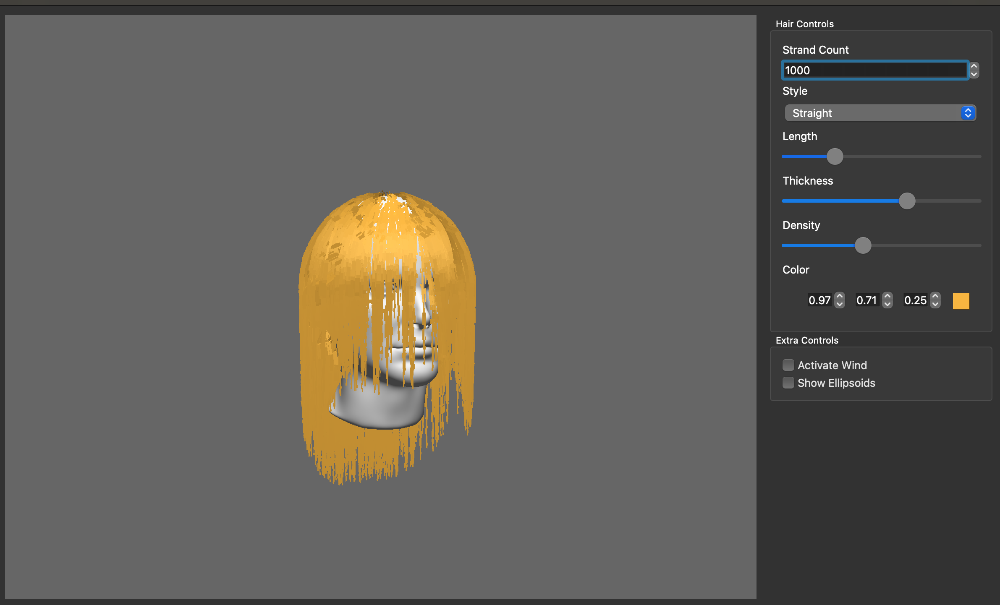
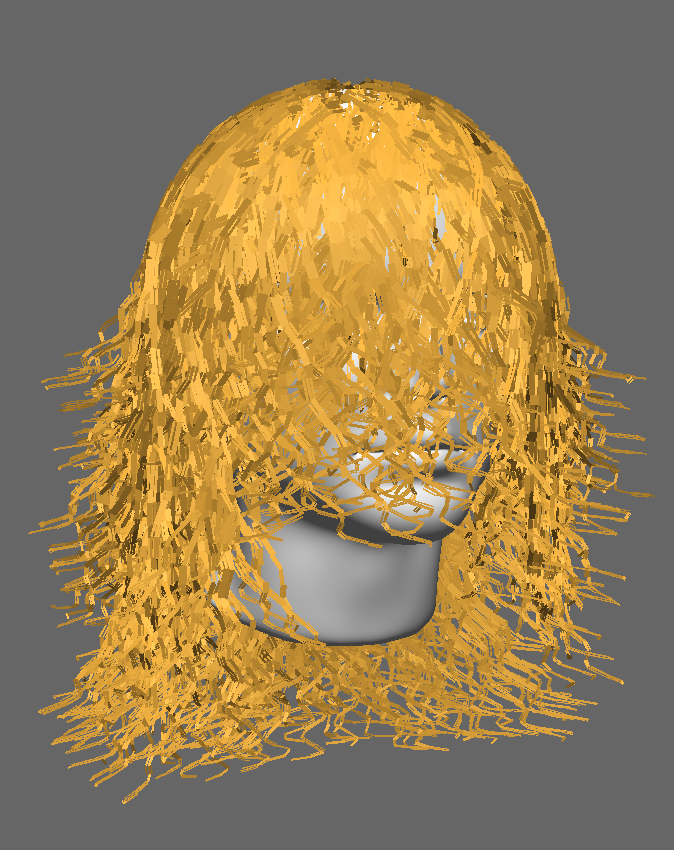
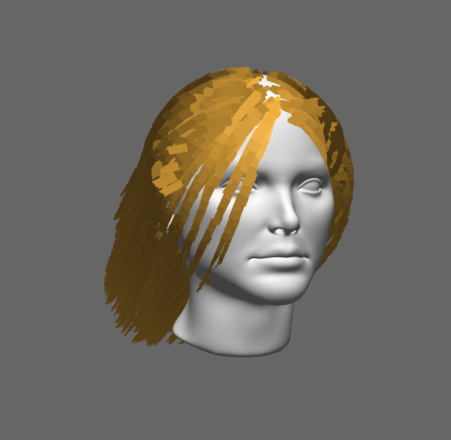
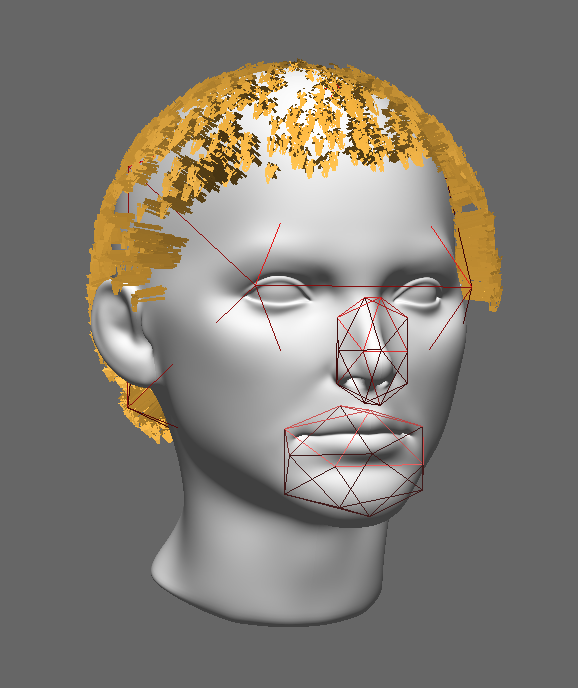
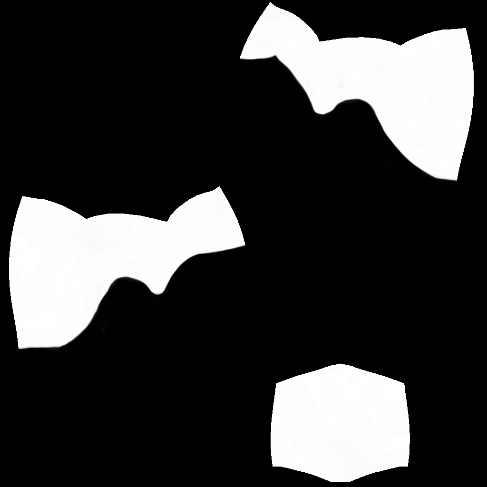
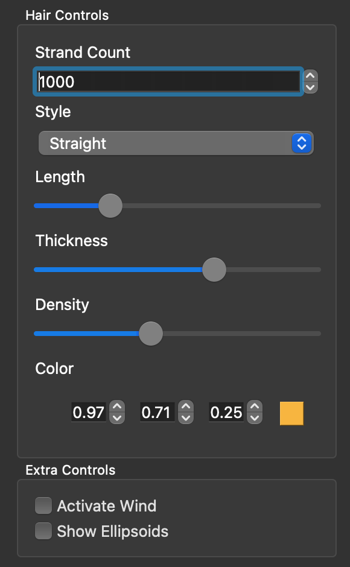
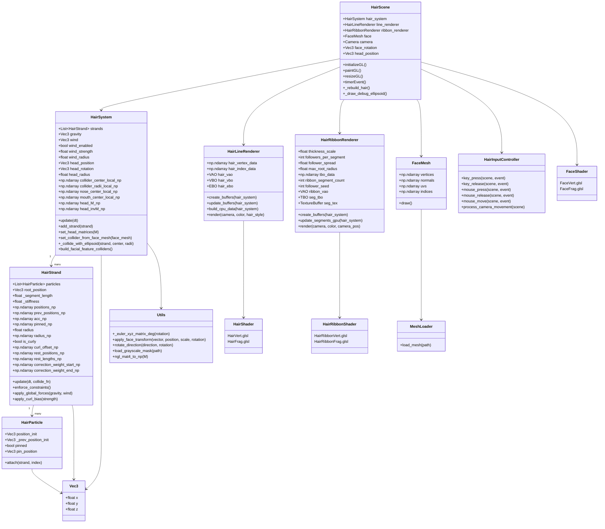

## Real‑Time Hair Simulation and Rendering System

### Run the project

1. Prerequisites
- Python 3.13 or higher: Ensure you have the latest stable version of Python installed.
- uv: This project uses uv for extremely fast dependency management.

2. Environment Setup
You don't need to manually create a virtual environment, uv will handle it. To sync dependencies defined in the `pyproject.toml`.

`uv sync`

3. Running the Simulation
The project is designed to be executed as a script. Run the following command from the root directory:

`uv run ./main.py`

### Overview

This project implements a real‑time, physically based hair simulation and rendering system for long hair attached to a deforming head mesh. The system focuses on physical plausibility, numerical stability and real‑time performance, while remaining fully interactive through a Qt user interface.

The project combines CPU side physics simulation (Verlet integration, constraints, collisions) with GPU side rendering and amplification (ribbon expansion, follower strands, shading), resulting in dense looking hair at a manageable computational cost.

## Technical Stack

For this project, the following were used:

- `Python` as the main programming language for simulation logic, rendering control, and application structure.
- `OpenGL 4.1` (via `PyOpenGL`) for real-time 3D rendering of the head mesh and hair strands.
- `GLSL` for custom vertex and fragment shaders used in hair ribbon rendering, lighting and shading.
- `NumPy` for vector and matrix operations, physics calculations, collision detection and GPU data preparation.
- `Qt 6 (PySide6)` for the graphical user interface, window management, and user interaction.
- `QOpenGLWidget` to embed the OpenGL renderer inside a Qt application.
- `ncca.ngl` utilities for camera control, transformations, shader management and debug primitives.
- `pytest` for unit testing of core simulation logic and mathematical utilities.

## High‑Level Architecture

The system is composed of five major layers:

1. Physics primitives: particles and strands
2. Hair system controller: global forces, wind, collisions
3. Rendering layer: line and ribbon renderers
4. Shaders: lighting, ribbon expansion and anti‑aliasing
5. Qt interface: real‑time parameter control

Each layer is designed to be as decoupled as possible, allowing physics, rendering, and UI to evolve independently.

## 1. Hair Representation

### 1.1 HairParticle

A `HairParticle` represents a single point along a strand. Particles store:

- Initial position (for rest pose)
- Current and previous positions (for Verlet integration)
- Accumulated acceleration
- Pinning state (root particles)

Particles **do not store velocity explicitly**. Velocity is implicitly derived from position history, which improves numerical stability.

### 1.2 HairStrand

A `HairStrand` is a chain of particles connected by distance constraints.

**Core Data**

- `positions_np`: current particle positions
- `prev_positions_np`: previous positions
- `rest_lengths_np`: rest distance per segment
- `radius_np`: tapered strand radius (thicker at root)
- `pinned_np`: pin mask for constraints

**Verlet Integration**

The strand uses **Verlet integration**:

`x(t+Δt) = x(t) + (x(t) − x(t−Δt)) * damping + a * Δt²`

This method is well suited for hair because:

- It avoids explicit velocities
- It is stable under stiff constraints
- It integrates naturally with positional corrections

**Constraint Enforcement**

Distance constraints maintain constant segment length:

* Each segment is corrected along its direction
* Corrections are weighted based on whether endpoints are pinned
* Multiple solver iterations are used per frame

The number of iterations adapts based on strand length to balance stability and performance.

### 1.3 Curly Hair Model

Curly hair is implemented as a rest pose deformation, not a force.

- A sinusoidal lateral offset is precomputed per particle
- Offset amplitude increases from root to tip
- Curl is applied as a bias after constraint solving

The curl offset for each particle is defined as:

`Δpi​ = sin(2πfti ​+ ϕ) Ati​`

where `ti` is the normalized position along the strand, `A` controls curl amplitude, `𝑓` the curl frequency, and `𝜙` a per-strand random phase.

This curled shape is precomputed at initialization and used as the strand’s rest pose, ensuring the simulation starts in a stable configuration. During updates, the curl is gently reintroduced after constraint solving, allowing the hair to move naturally while preserving its curled appearance.

Key design choice:

`Curly hair starts in its rest pose, preventing the classic “explosion on frame 0”.`

This approach preserves physical motion while maintaining curl shape.

## 2. Hair System Controller

### 2.1 HairSystem

The `HairSystem` manages all strands and applies global effects.

Responsibilities:
- Applying gravity and drag
- Applying wind forces
- Pinning strand roots to the animated head
- Handling collisions

The system operates entirely in world space, except for collision detection.

### 2.2 Head Attachment

Each strand stores a `root_local` position in head local space.

Each frame:
- Head transform matrix is updated
- Root positions are transformed into world space
- Roots are hard pinned to the head

This ensures hair follows head motion perfectly while allowing the rest of the strand to lag naturally.

### 2.3 Wind Model

Wind is modeled as a **directional fan** in front of the face:
- Wind direction depends on head rotation
- Strength increases toward strand tips
- Procedural turbulence is added using time‑varying sine waves

The wind force applied to each particle is computed as:

`Fi ​= dwind​ * S * ti ​+ N(t,i)`

where `𝑑 wind` is the head-aligned wind direction, `𝑆` is the global wind strength, `𝑡𝑖` is the normalized position along the strand (root to tip), and `𝑁(𝑡,𝑖)` is a time varying noise term.

This design keeps hair near the scalp stable while allowing the tips to respond more strongly and unpredictably. The added turbulence breaks uniform motion, producing more natural, lively hair movement without introducing instability.

This produces:
- Coherent motion near the root
- Chaotic, lively motion at the tips

## 3. Collision System

### 3.1 Ellipsoidal Colliders

Collisions are handled using ellipsoids instead of spheres for better anatomical fit.

Colliders:
- Head (main ellipsoid)
- Nose (small forward ellipsoid)
- Mouth (lower forward ellipsoid)

Ellipsoids are computed from the face mesh bounding box and scaled heuristically.

### 3.2 Collision Space Transform

Collision detection is performed in head local space:
1. Particle positions are transformed into head space
2. Ellipsoid equation is evaluated: `(x/a)² + (y/b)² + (z/c)² < 1`
3. Penetrating particles are projected to the surface
4. Velocity is decomposed into normal and tangential components
5. Friction is applied to tangential motion

Corrected positions are transformed back to world space. This approach keeps collisions stable even under head rotation.

## 4. Rendering System

### 4.1 Dual Renderer Design

The project uses two rendering paths:

1. `Line renderer`: debugging, thin hair
2. `Ribbon renderer`: thick, realistic hair

The renderer is chosen dynamically based on hair thickness.

### 4.2 Line Renderer

The line renderer draws strand centerlines using:
- A single VBO containing `(x, y, z, radius)`
- An index buffer with **primitive restart** to separate strands

It supports:
- Line strips
- Optional point rendering (for braids/debugging)

This renderer is simple and CPU driven.

### 4.3 Ribbon Rendering Technique

The ribbon renderer is the core visual technique used to efficiently display thousands of hair strands in real time.

Instead of rendering each hair as a full 3D cylinder, the system renders **camera facing ribbons** that approximate cylindrical hair fibers while remaining inexpensive to draw.

**Guide Strands**

Only a reduced set of **guide strands** is simulated on the CPU. These guide strands capture the physical motion of the hair and act as the source for all rendered geometry.

Each strand is decomposed into line segments, where each segment stores:
- Start position (*A*) + radius (*rA*)
- End position (*B*) + radius (*rB*)

These are uploaded to the GPU via a **Texture Buffer Object (TBO).** Using a TBO allows the vertex shader to randomly access segment data without duplicating vertices on the CPU.

**GPU Expansion**
On the GPU, each line segment is expanded into a quad directly in the vertex shader:
- Each segment becomes a camera‑facing quad
- The quad is expanded perpendicular to the view direction
- Thickness is derived from per vertex radius

This is based on techniques from GPU Gems and Marschner et al.

### 4.4 Follower Strands (GPU Hair Density)

To increase visual density efficiently:
- Each guide segment spawns multiple follower strands on the GPU
- Followers are offset around the guide using a local frame
- Offsets taper toward the root
- Randomization is deterministic via seeds

This creates the illusion of thousands of hairs while simulating only hundreds.

`This is the key optimization that enables real‑time dense hair.`

## 5. Shading and Lighting

### 5.1 Hair Shading Model

Hair shading uses a simplified physically‑inspired model:
- Diffuse lighting
- Specular highlights aligned with strand tangent
- Rim lighting for silhouette enhancement

While not a full Marschner BRDF, it captures key visual cues:
- Anisotropy
- Gloss along hair direction

### 5.2 Alpha‑to‑Coverage

To avoid harsh transparency artifacts:
- Alpha‑to‑coverage is enabled
- Multisampling smooths thin ribbons

This is critical for dense overlapping geometry like hair.

## 6. Texturing and Masks

### 6.1 Hair Distribution Mask

A grayscale texture is used to control hair placement:
- White areas spawn hair
- Black areas are bald

The mask is sampled during strand generation, not rendering.

This allows:
- Natural hairlines
- Clean parting
- Artistic control

## 7. Qt User Interface

The system includes a real‑time Qt UI with controls for:
- Strand count
- Hair length
- Thickness
- Density (followers per segment)
- Hair style (straight, curly, braids)
- Wind toggle
- Debug collider visualization

All parameters update live without restarting the simulation.

## 8. Performance Considerations

Key optimizations:
- Verlet integration (cheap, stable)
- Adaptive constraint iterations
- CPU simulation of guides only
- GPU instancing for followers
- TBO‑based data streaming

The result is smooth interaction even with visually dense hair.

## 9. UML Diagram

